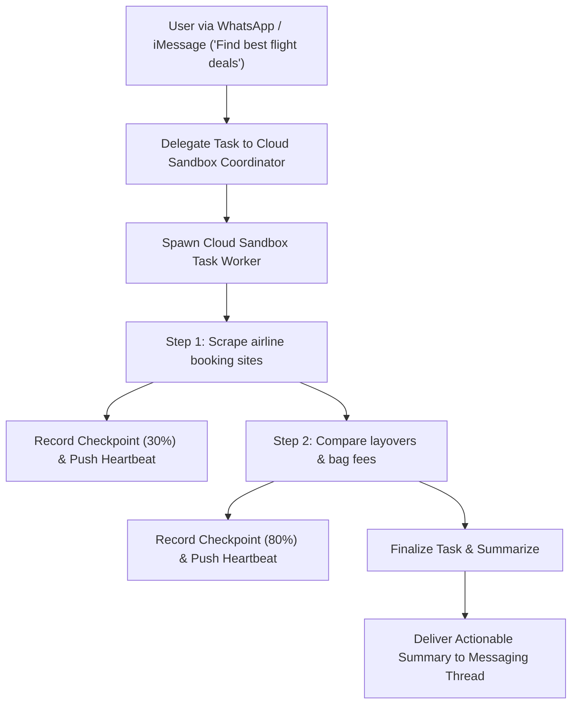

# genpark-cloud-sandbox-task-delegation-coordinator-skill

> Cloud Sandbox Long-Running Task Delegation Coordinator with Heartbeats. 100% Python Standard Library.

Distilled from **Muse** (Meta) and **Instinct**, where personal agents manage long-horizon web tasks in isolated cloud virtual sandboxes while broadcasting periodic progress heartbeats back to messaging channels.

## Architecture

## Features
- **Asynchronous State Checkpointing**: Retains execution milestones for graceful resume after disconnections.
- **Heartbeat Emitters**: Emits real-time progress percentages to keep users informed without message spam.
- **Clean Completion Hooks**: Bundles final insights into concise messages suitable for SMS/iMessage delivery.
